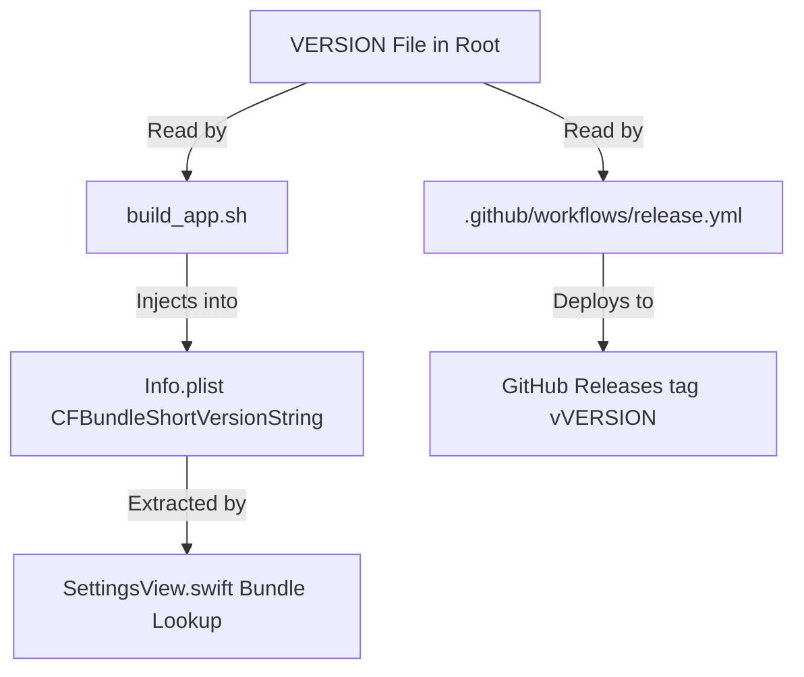

# Agent Developer Specifications: Buffer for Mac Structure & Releases

This document serves as the architectural blueprint and operational handbook for all AI coding agents and human developers maintaining this repository.

---

## 1. Project Directory Structure

* **`VERSION`**: The central source of truth for the application version (e.g., `0.0.1`). Used by all build scripts and remote CI pipelines.
* **`Sources/`**: The core Swift application source code.
  * **`main.swift`**: Bootstraps the standard AppKit event loop using the `AppDelegate`.
  * **`AppDelegate.swift`**: Handles the macOS status bar menu bar agent life-cycle, popover display triggers, global keyboard shortcut interception, and native Preferences/About window states.
  * **`BufferMenubarView.swift`**: The container view which swaps between loading spinners, the `LoginView` (unauthenticated), and the `ComposerView` (authenticated) inside the popover.
  * **`LoginView.swift`**: Redesigned sign-in panel containing the dynamic 3D isometric vector logo, secure developer OAuth token creation help button, and accessibility warning cards.
  * **`ComposerView.swift`**: The primary posting dashboard supporting profile checkboxes, character counters, image drawers, drag-and-drop links, alt-text sheets, and smart emoji autocomplete suggestions.
  * **`SettingsView.swift`**: Scrollable General preferences grid and Accounts verification dashboard. Reads bundle plists dynamically at runtime.
  * **`BufferAPI.swift`**: High-performance asynchronous client handling all communication with the official Buffer endpoints with zero passive background call overhead.
  * **`CatboxUploader.swift`**: Secure anonymous multipart media uploader generating public URL paths via Catbox.moe for platform-specific attachments.
  * **`Storage.swift`**: Local caching layers managing draft text backups, selected profiles, cached accounts, and email data on UserDefaults.
  * **`AppIcon.png`**: High-fidelity, macOS-native white feather squircle app icon, which is compiled natively into the app bundle.
* **`Package.swift`**: Swift Package Manager package manifest describing dependencies and macOS Ventura (v13.0) minimum OS limits.
* **`build_app.sh`**: Compiles universal release binaries for Intel and Apple Silicon targets, compiles `AppIcon.png` into `AppIcon.icns`, packages the standalone `BufferMenubar.app` bundle, and programmatically writes dynamic `Info.plist` metadata.
* **`build_dmg.sh`**: Triggers `build_app.sh` and creates a high-density native drag-to-install installer `.dmg` file (`Buffer-Mac.dmg`) using native `hdiutil`.
* **`.github/workflows/release.yml`**: Continuous Integration and deployment workflow that compiles universal DMGs on push to main and deploys both historical version releases and rolling latest pre-releases.

---

## 2. Dynamic Versioning & Release Pipeline

The versioning model is completely automated and centrally controlled. The pipeline operates as follows:



1. **Local Compilation**: `build_app.sh` reads the root version file:
   ```bash
   APP_VERSION="$(cat "${WORKSPACE_DIR}/VERSION" | xargs)"
   ```
   It writes this value into `CFBundleShortVersionString` of `Info.plist` during bundle packaging.
2. **Swift Runtime Lookup**: `SettingsView.swift` queries the bundle plist dynamically:
   ```swift
   let currentVersion = Bundle.main.infoDictionary?["CFBundleShortVersionString"] as? String ?? "0.0.1"
   ```
   This ensures the UI settings footer and dynamic update-checking procedures always align perfectly with the compiled version.
3. **GitHub Deployment**: The workflow `release.yml` parses `VERSION` during pushes to `main` and creates a brand-new, dedicated release tag `v[VERSION]` (e.g. `v0.0.1`) containing the universal `Buffer-Mac.dmg` asset. Concurrently, it updates the `latest` rolling pre-release tag to point to the newest DMG.

---

## 3. Strict AI Agent Enforcement Rules

All future AI agents working on this codebase **must** adhere to the following operational constraints:

* **DO NOT** edit or hardcode the version string (`"0.0.1"`, `"1.0.0"`, etc.) directly inside Swift views or build scripts. All version queries must refer directly to the root `VERSION` file or standard SwiftUI bundle lookups.
* **INCREMENT VERSION FILE**: Before making commits that introduce polished features, bug fixes, or enhancements, you **must** increment the version number in the root `VERSION` file by at least a patch version (e.g., from `0.0.1` to `0.0.2`).
* **AUTOMATED TESTING**: Always trigger `./build_dmg.sh` locally to verify that your changes compile successfully under both Intel and Apple Silicon targets before committing and pushing your updates.
